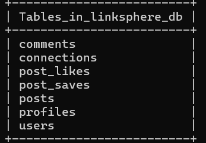
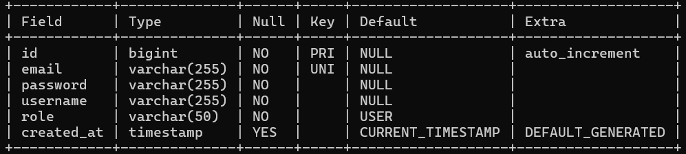
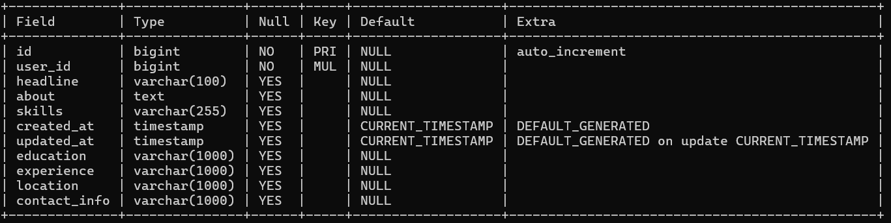
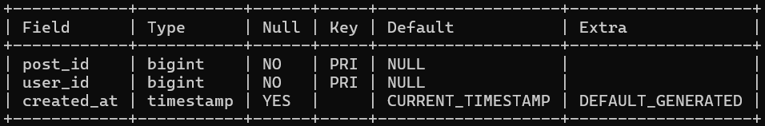
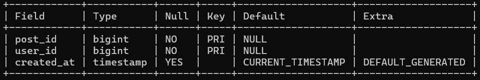
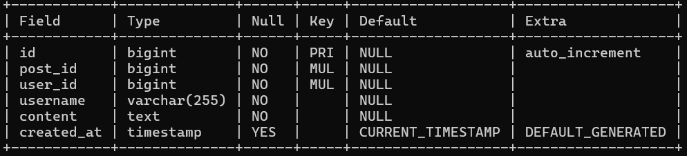
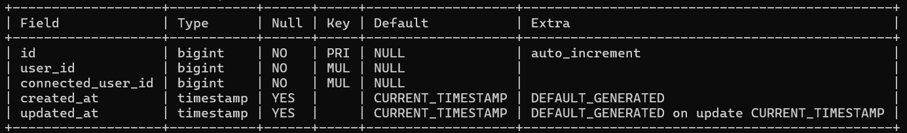

# LinkSphere Backend

<p align="center">
  <b>Professional Networking Platform API</b>
</p>

## 🖥️ Overview

LinkSphere Backend is a robust RESTful API built with Spring Boot and MyBatis to power the LinkSphere professional networking platform. This repository contains the server-side codebase that handles authentication, data persistence, and business logic.

## ✨ Features

### 🔐 Authentication & Security
- User registration and login
- JWT-based authentication
- Password encryption with BCrypt

### 👤 User Management
- Profile creation and updates
- Skills and experience management
- Education details
- Contact information

### 📝 Content Management
- Post creation, editing, and deletion
- Media handling
- Content moderation

### 🔄 Interactions
- Like/unlike functionality
- Comment system
- Post saving

### 🏠 Feed Generation
- Personalized feed algorithms
- Pagination support
- Sorting and filtering

### 🔍 Search Functionality
- User search
- Post search
- Advanced filtering

## 🛠️ Technology Stack

- **Framework**: Spring Boot
- **Database**: MySQL
- **Authentication**: JWT + Spring Security
- **Build Tool**: Maven

## 📂 Project Structure

```
├── config/         # Application configuration
├── controller/     # REST API controllers
├── service/        # Business logic
├── mapper/         # MyBatis mappers
├── model/          # Data models/entities
├── dto/            # Data Transfer Objects
├── security/       # Authentication & authorization
└── utils/          # Helper utilities
```

## 🚀 Getting Started

### Prerequisites
- Java JDK 11 or higher
- MySQL 8.0 or higher
- Maven 3.6 or higher
- Git

### Setup Instructions
1. Clone the repository
   ```bash
   git clone https://github.com/KrunalgiriGoswami/frontend_flutter.git
   
   cd frontend_flutter

 2. Update application.yml:
    ```bash
    spring:
    datasource:
    url: jdbc:mysql://localhost:3306/proconnect
    username: root
    password: yourpassword

 3. Run the application:
    ```bash
    ./mvnw spring-boot:run

###  📌Ensure MySQL is running and linksphere database is created.

##  📡 API Overview

| Method | Endpoint              | Description           |
| ------ | --------------------- | --------------------- |
| POST   | `/auth/register`      | Register new user     |
| POST   | `/auth/login`         | Login and receive JWT |
| GET    | `/users/{id}`         | View profile          |
| PUT    | `/users/{id}`         | Edit profile          |
| GET    | `/posts`              | View all posts        |
| POST   | `/posts`              | Create post           |
| PUT    | `/posts/{id}`         | Edit post             |
| DELETE | `/posts/{id}`         | Delete post           |
| POST   | `/posts/{id}/like`    | Like/Dislike post     |
| POST   | `/posts/{id}/comment` | Add comment           |
| GET    | `/search/users`       | Search users          |
| GET    | `/search/posts`       | Search posts          |


## 📊 Database Tables

<table>
  <tr>
    <td align="center"><b>📁 Tables Overview</b><br></td>
  </tr>
  <tr>
    <td align="center"><b>👤 User Table</b><br></td>
  </tr>
  <tr>
    <td align="center"><b>🧾 Profile Table</b><br></td>
  </tr>
  <tr>
    <td align="center"><b>📝 Posts Table</b><br></td>
  </tr>
  <tr>
    <td align="center"><b>👍 Post Likes Table</b><br></td>
  </tr>
  <tr>
    <td align="center"><b>📌 Post Saves Table</b><br></td>
  </tr>
  <tr>
    <td align="center"><b>💬 Comments Table</b><br></td>
  </tr>
  <tr>
    <td align="center"><b>🤝 Connections Table</b><br></td>
  </tr>
</table>
