# LinkSphere Frontend

## 📱 Overview

LinkSphere is a professional networking platform built with Flutter. This repository contains the frontend codebase that provides a seamless and responsive user experience across devices.

## ✨ Features

### 🔐 Authentication
- Secure registration and login
- JWT token management
- Password validation

### 👤 Profile Management
- View and edit professional profiles
- Skills showcase
- Education and experience details
- Professional headline and about section

### 📝 Content Sharing
- Create, edit, and delete posts
- Media attachments support
- Rich text formatting

### 🔄 Interactions
- Like/unlike posts
- Comment on posts
- Save posts for later

### 🏠 Feed Management
- Personalized home feed
- Infinite scroll with pagination
- Pull-to-refresh functionality

### 🔍 Search & Connections
- Search for users and posts
- Connection suggestions
- Manage professional connections

## 🛠️ Technology Stack

- **Framework**: Flutter
- **State Management**: Provider
- **HTTP Client**: HTTP package
- **Local Storage**: SharedPreferences
- **UI Components**: Custom widgets with Material Design

## 📂 Project Structure

```
├── lib/
    ├── core/       # Core functionality, constants, themes
    ├── features/   # Feature-specific screens and logic
    ├── models/     # Data models
    ├── services/   # API services and local storage
    ├── ui/         # UI components and screens
    ├── widgets/    # Reusable widgets
    └── main.dart   # Application entry point
```

## 🚀 Getting Started

### Prerequisites
- Flutter SDK
- Dart SDK
- Android Studio / VS Code
- Git

### Setup Instructions

1. Clone the repository
   ```bash
   git clone https://github.com/KrunalgiriGoswami/frontend_flutter.git

   cd frontend_flutter

2. Install dependencies:
   ```bash
   flutter pub get

3. Run the app:
   ```bash
   flutter run

###  📌Ensure you’re using Flutter 3.x or higher. Update your API base URL in services/api.dart.

## 📸 Screenshots

<table>
  <tr>
    <td align="center"><b>🔗 LinkSphere Logo</b><br>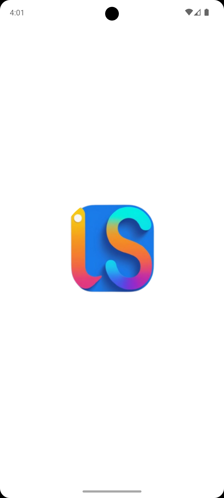</td>
    <td align="center"><b>🔐 Sign In</b><br>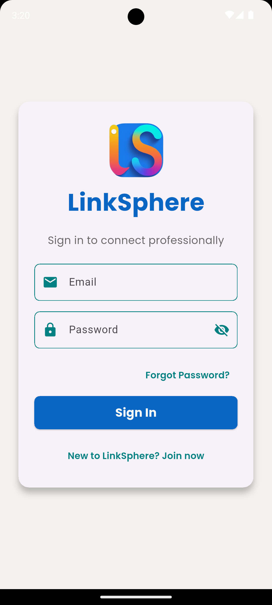</td>
    <td align="center"><b>📝 Sign Up</b><br>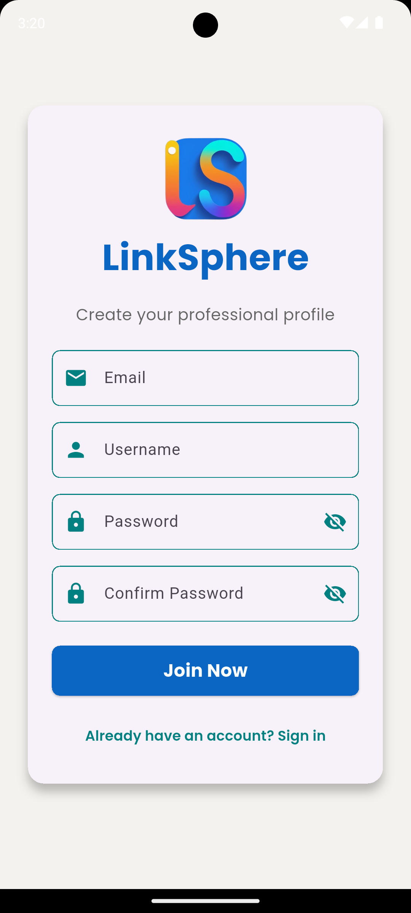</td>
    <td align="center"><b>🏠 Home Feed #1</b><br>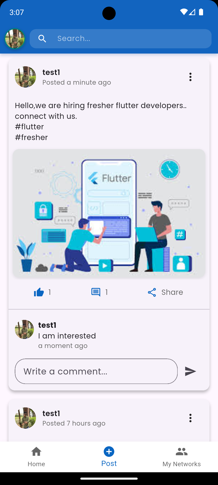</td>
  </tr>
  <tr>
    <td align="center"><b>🏠 Home Feed #2</b><br>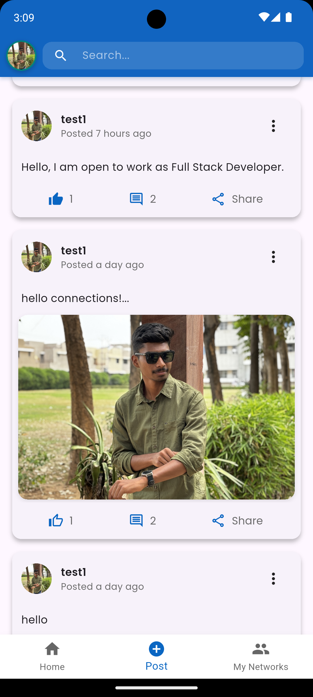</td>
    <td align="center"><b>🖊 Post Detail</b><br>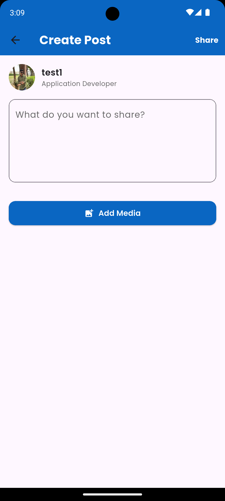</td>
    <td align="center"><b>👤 Profile View</b><br>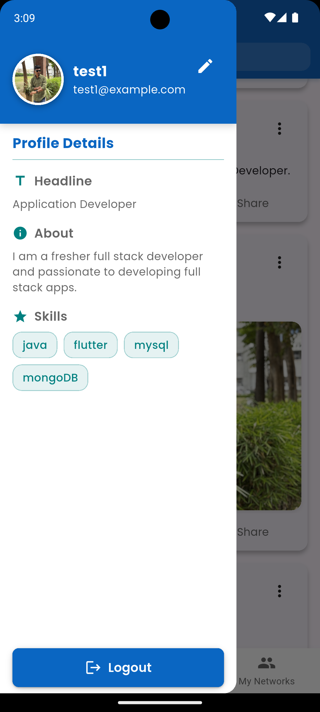</td>
    <td align="center"><b>👤 Profile Edit</b><br>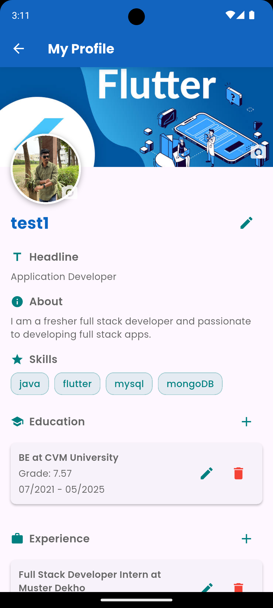</td>
  </tr>
  <tr>
    <td align="center"><b>👤 Profile Skills</b><br>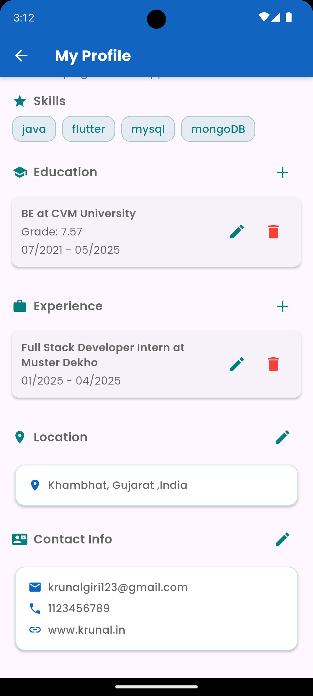</td>
    <td align="center"><b>📤 Share Post</b><br>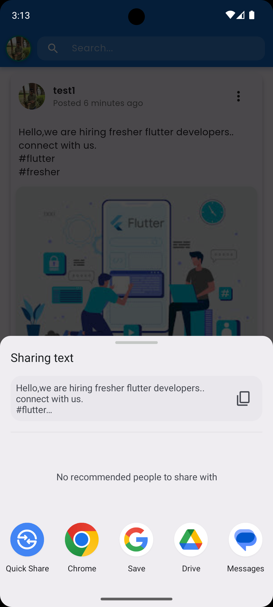</td>
    <td align="center"><b>🤝 Connections</b><br>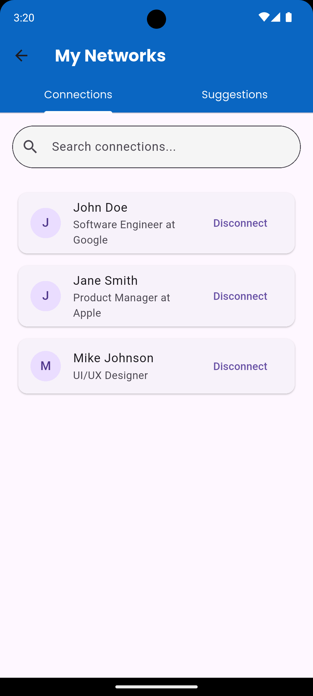</td>
    <td align="center"><b>💡 Suggestions</b><br>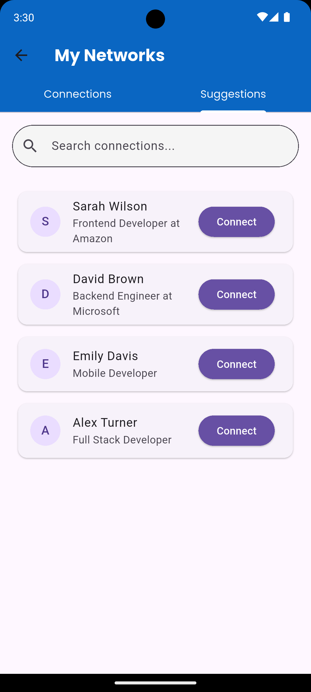</td>
  </tr>
</table>


